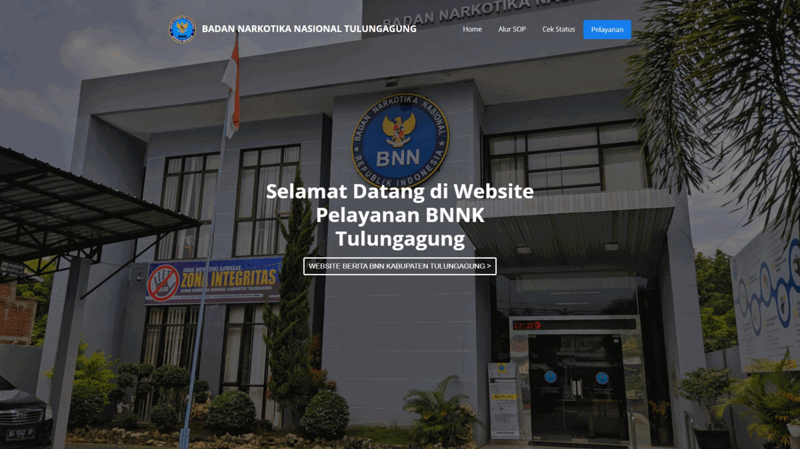

# Hi there, I'm [Laduni][website] 

This is the place where I break things :rofl:

- 🔭 &nbsp;I’m currently working on something cool :wink:
- 🌱 &nbsp;I’m currently learning Laravel Ecosystem
- 📕 &nbsp;I'm currently studying master degree in Shandong University
- 💬 &nbsp;Ask me about anything related to PHP/HTML/CSS or Laravel/Livewire/Tailwind
- 📫 &nbsp;Reach me on: [twitter](https://twitter.com/laduniestu) or [instagram](https://instagram.com/laduniestu)
- 👨‍💻 &nbsp;Read more about my projects at [syalwa.com](https://www.syalwa.com/)
- ⚡ &nbsp;Fun fact: I :heart: :cat:s and playing piano / guitar

🔗 &nbsp;**Connect with me**

  
📊 &nbsp;**This week I spent my time on**
  

  
<b>✨&nbsp;&nbsp;About&nbsp;Me</b>

   
Hola 👋

My name is Laduni Estu Syalwa from Indonesia 🇮🇩. Last year, I was a student from State Polytechnic of Malang majoring in Information Technology. Now, I got a scholarship to continue my postgraduate studies at 🎓Shandong University of Science and Technology in China majoring in 💻Computer Application and Technology.

I enjoyed 👨‍💻learning basic web programming from Middle School to High School. Then, I went back into programming in the early days of college and started to focus on the world of Web Programming in the middle of college.

I learned to develop myself by becoming a Head of Division in the Organization as well as honing Teamwork while being a Coordinator in several event. Carry out an internship mandate at the National Narcotics Agency of Tulungagung Regency by creating a Public Service Website and completing my Diploma with a Final Project making an 🌐application for my institute, namely a map or building directions with augmented reality technology by the end of 2020.

I never stop to learn. Because one of my hobbies is learning new things. Of course, I'm still trying to improve myself and increase my ⚡skills till this day.

  
<b>🛠️&nbsp;&nbsp;Languages&nbsp;and&nbsp;Tools</b>

   
  

    
    
    
    
    
    
    
    
    
    
    
    
    
    
    
    
    
    
    
    
    
    
    
    
    

  

  
<b>📈&nbsp;&nbsp;Language&nbsp;/&nbsp;Framework stats</b>

   
  

  
<b>✨&nbsp;&nbsp;Example&nbsp;Of&nbsp;Work</b>

   
  
  

[website]: https://syalwa.com
